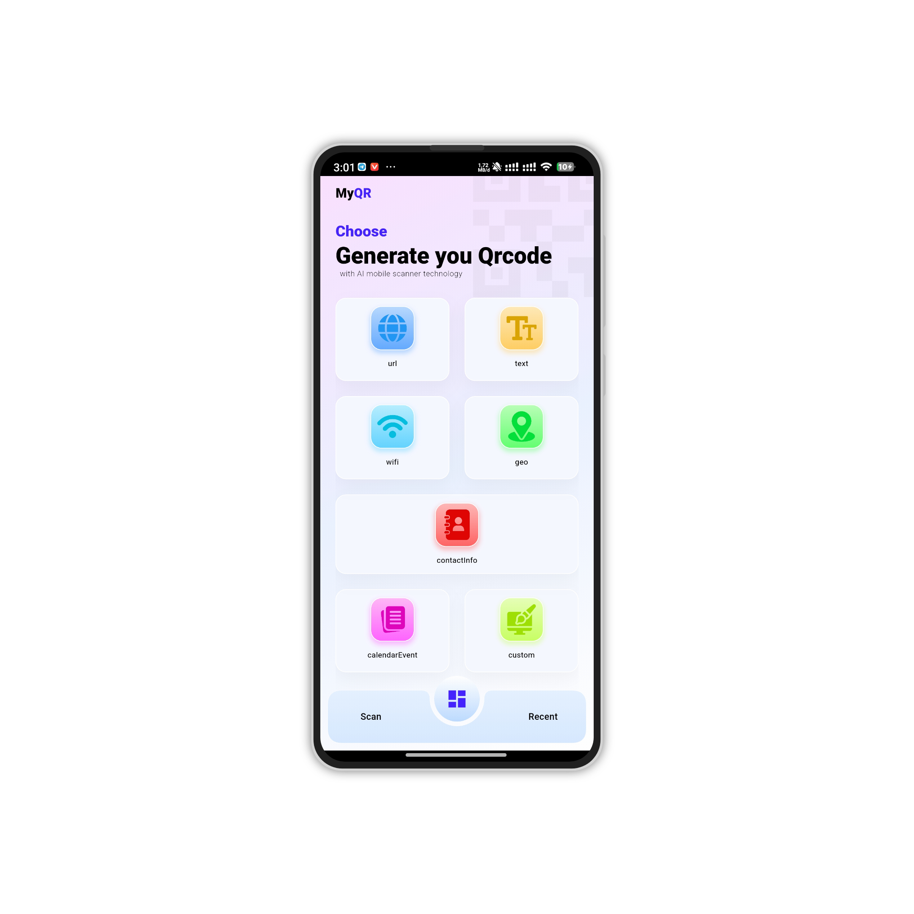
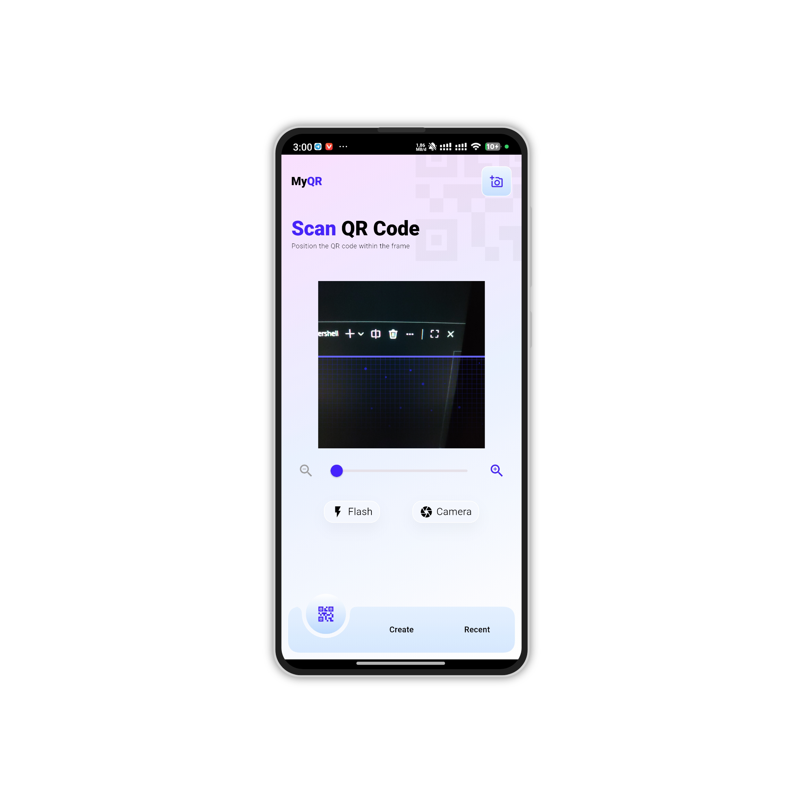
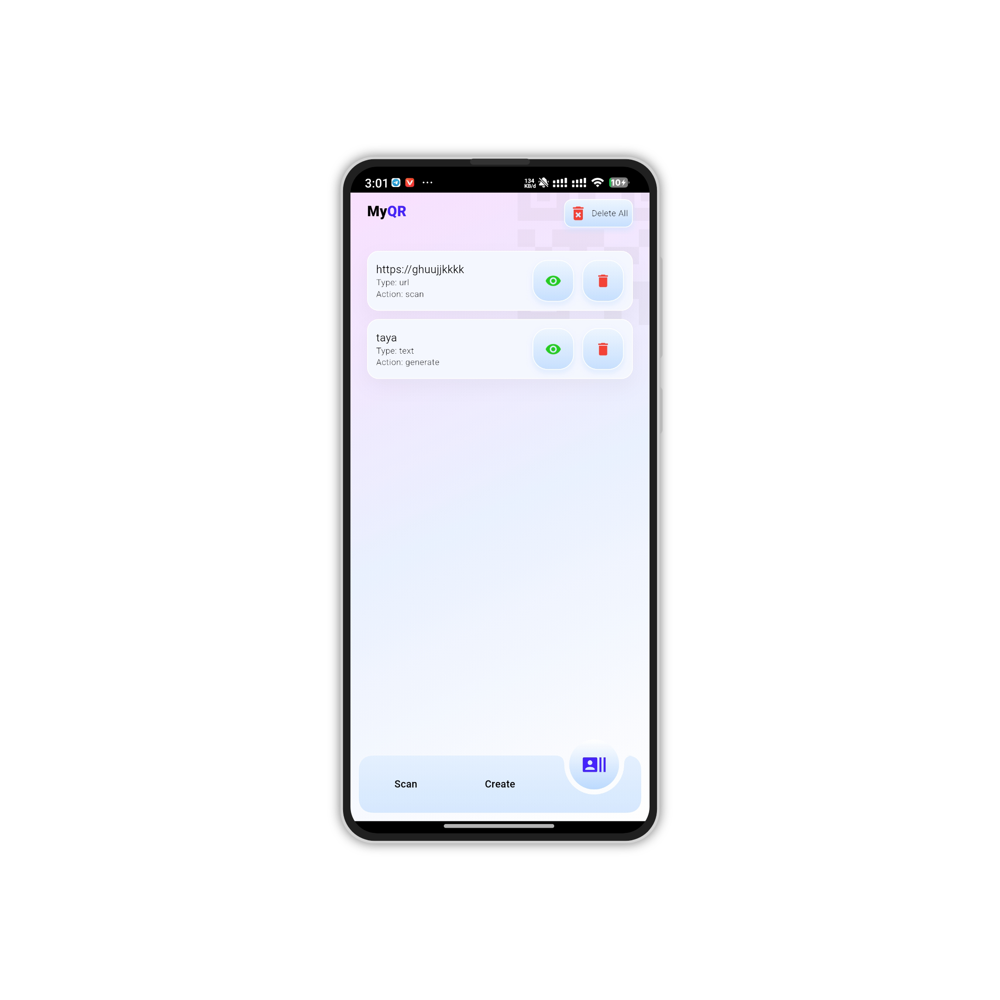
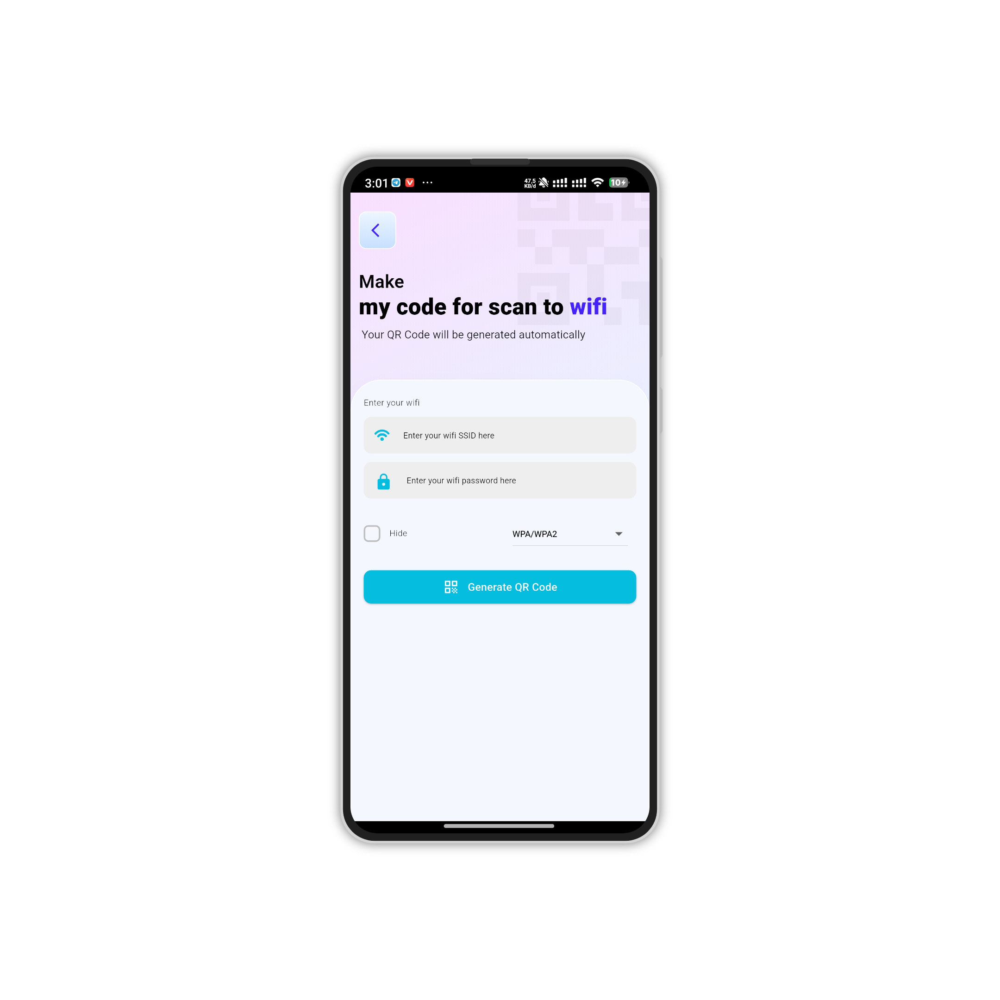
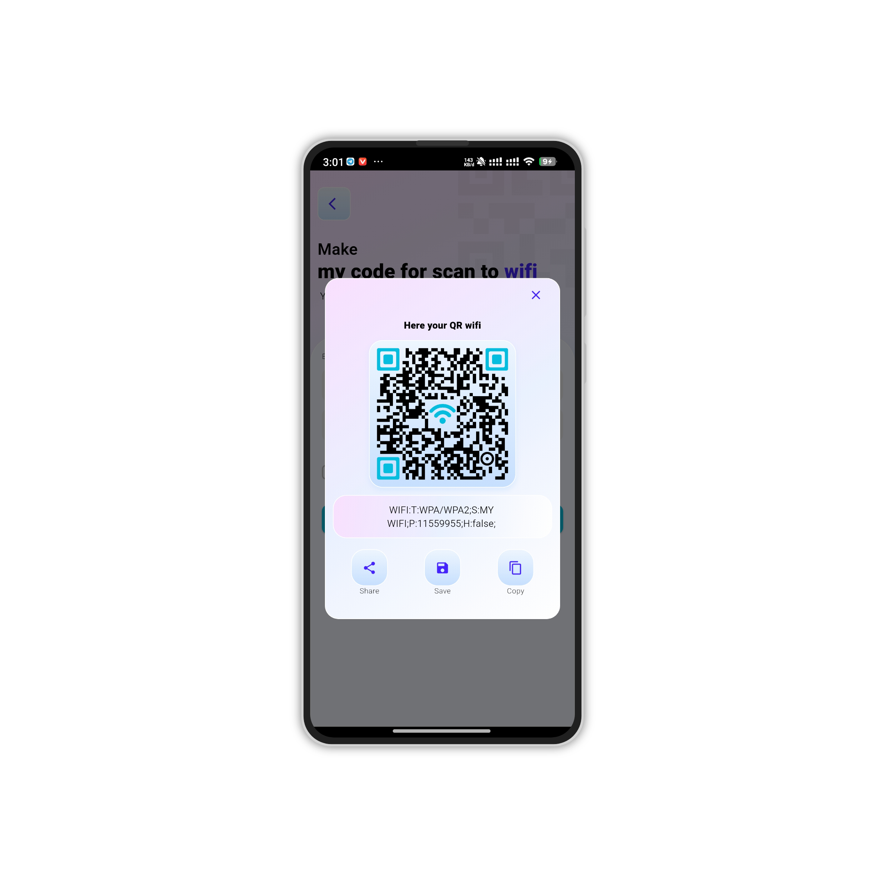

# MyQR — Flutter QR Code Generator & Scanner

MyQR is a lightweight and modern Flutter application for generating and scanning QR codes with ease.
This app allows users to create custom QR codes, scan QR codes using the device camera, and even scan QR codes directly from images in the gallery.

Designed with a clean UI and fast performance, MyQR is perfect for learning, daily use, and as a starter project for QR-based applications.


## Running▶️

Clone this repository:

```bash
  git clone https://github.com/yandev2/MyQR-Flutter-QR-Code-Generator-Scanner.git
```
Install dependencies:

```bash
  flutter pub get
```
Run the app:
```bash
  flutter run
```


## Documentation

🚀 Features

📌 Generate QR Code from text or data

📷 Scan QR Code using device camera (real-time)

🖼 Scan QR Code from image (gallery picker)

💾 Save generated QR codes locally

📤 Share QR codes to other apps

⚡ Fast, lightweight, and easy to use


🎯 Goal

This project aims to provide a simple yet powerful QR solution while keeping the codebase clean, scalable, and beginner-friendly.


## Screenshots









## Contributing🙌

Contributions, issues, and feature requests are welcome!
Feel free to fork this project and submit a pull request.


## Support⭐


If you like this project, don't forget to give it a ⭐ on GitHub!

## Download


